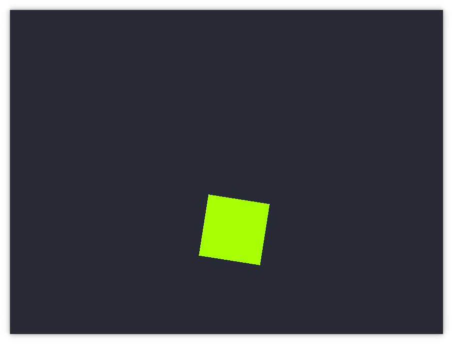

# Peach Example Sketches
This directory includes examples of how to use the Peach library.

## [events.rs](events.rs)
Example usage and basic explanation of all event callbacks provided by Peach.

## [basic.rs](basic.rs)

Basic usage demonstration.
